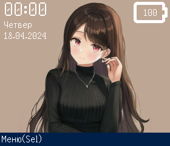
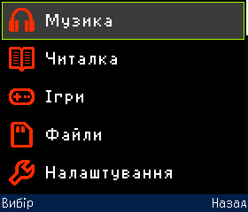
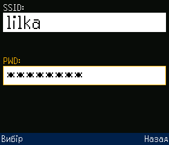

# Можливості  

Основні можливості, які пропонує Meowui:  

* Керування макетами графічного інтерфейсу та вивід їх на дисплей.
* Обробка користувацького вводу з кнопок, сенсорних пінів мікроконтролера та підтримка деяких драйверів сенсорних дисплеїв. 
* Проста архітектура, яка буде зрозуміла будь-кому, хто має досвід розробки на Arduino.
* Ігровий рушій для розробки 2D ігор в тому числі багатокористувацьких.

Крім вище зазначених функцій в Meowui адаптовано деякі стороні та реалізовано власні бібліотеки для виконання різноманітних завдань. Наприклад, власна бібліотека для взаємодії із картою пам’яті.  
  
В якості графічного ядра фреймворку використовується модифікована бібліотека TFT_eSPI. Завдяки цьому досягається підтримка більшості популярних драйверів дисплеїв. Потрібно лише в налаштуваннях вказати драйвер дисплею та його параметри. 

!!! warning "Важливо"
    З оригінальною бібліотекою TFT_eSPI Meowui працюватиме некоректно!

Нижче наведено приклади типового інтерфейсу на Meowui.  

  

  

  

  

